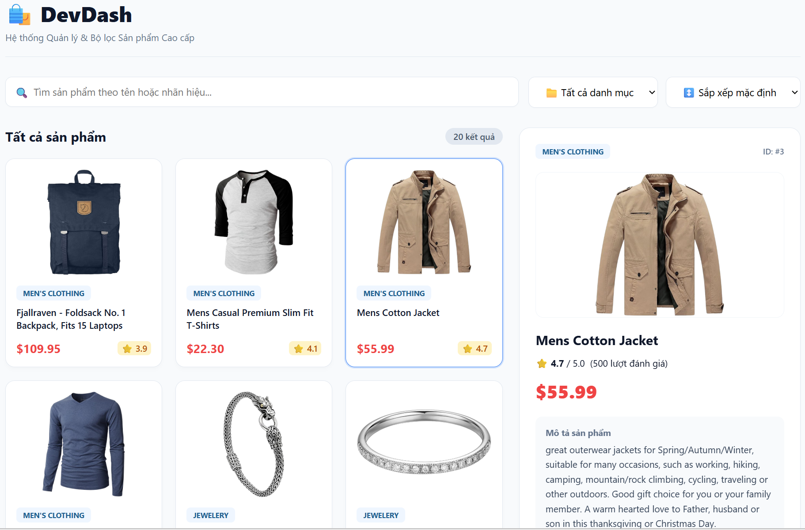
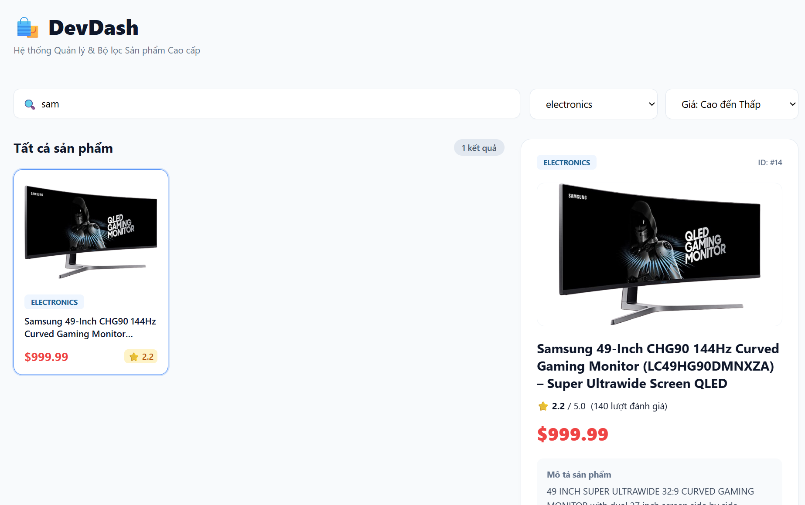

# DevDash — Dashboard Quản Lý & Bộ Lọc Sản Phẩm Cao Cấp

**DevDash** là một ứng dụng Single Page Application hiển thị và tương tác với danh sách sản phẩm theo thời gian thực được viết bằng **TypeScript** và **Vite**. Dự án tập trung áp dụng các kỹ thuật xử lý mảng nâng cao (HOF), quản lý luồng bất đồng bộ (Async/Await, Promise.all) và tối ưu hóa hiệu năng giao diện, đảm bảo an toàn kiểu dữ liệu tuyệt đối (Type Safety) ở chế độ nghiêm ngặt (`"strict": true`).

* **Repository GitHub:** https://github.com/phamhongle412004-bit/ajt-devdash-

---

## 📸 Ảnh chụp màn hình giao diện (Screenshots)

### Giao diện tổng quan DevDash

### Giao diện sắp xếp sản phẩm theo danh mục

### Giao diện sắp xếp sản phẩm theo giá

### Giao diện tìm kiếm sản phẩm

---

## 🛠️ Hướng dẫn cài đặt và Khởi chạy cục bộ (Local Run & Build Instructions)

### 1. Tải các thư viện phụ thuộc (Dependencies)
Mở terminal tại thư mục gốc của dự án (`ajt-devdash`) và chạy lệnh: npm install
### 2. Khởi chạy chế độ phát triển (Local Run/Development)
Chạy lệnh: npm run dev
Sau khi chạy xong, nhấn giữ Ctl và click vào đường dẫn hiển thị trên terminal
### 3. Biên dịch dự án sang Production
Chạy lệnh: npm run build

---

## 🌟 Danh sách tính năng hoàn thành (Features Checklist)

Dự án đã hoàn thành xuất sắc tất cả các hạng mục yêu cầu trong Rubric chấm điểm:

### Pass Tier (Nền tảng: 6.0 điểm)
- [x] **Strict Compilation:** Cấu hình `"strict": true` trong `tsconfig.json`, hoàn toàn không có lỗi biên dịch (Zero compiler errors) và không lạm dụng kiểu `any`.
- [x] **Domain Data Modelling:** Định nghĩa rõ ràng các `interface` cho dữ liệu từ FakeStoreAPI (Sản phẩm, Danh mục, Đánh giá).
- [x] **Async Fetching:** Sử dụng `async/await` kết hợp với Fetch API để lấy dữ liệu.
- [x] **Error Handling:** Sử dụng bọc `try/catch` chặt chẽ, kiểm tra trạng thái `res.ok` và hiển thị màn hình báo lỗi (`error-box`) trực quan kèm nút "Thử lại".
- [x] **Detail View:** Xem chi tiết thông tin sản phẩm (mô tả, số sao, lượt đánh giá) theo `id` khi click vào danh sách.

### Good Tier (Nâng cao: 2.0 điểm)
- [x] **HOF Data Transformation:** Tìm kiếm, lọc theo danh mục và sắp xếp theo giá được xử lý đồng thời bằng các hàm bậc cao (`filter`, `map`, `find`).
- [x] **Generic Fetch Helper:** Xây dựng hàm helper dùng chung `fetchJson<T>(url: string): Promise<T>` có kiểm soát lỗi hệ thống.
- [x] **Parallel Loading:** Sử dụng `Promise.all` để tải song song danh sách sản phẩm và danh mục cùng một lúc, tối ưu tốc độ tải trang.
- [x] **Union/Literal State:** Trạng thái ứng dụng được mô hình hóa chặt chẽ qua tập hợp các trạng thái cố định (`idle` | `loading` | `error` | `success`).

### Excellent Tier (Xuất sắc: 2.0 điểm)
- [x] **Discriminated Union:** Sử dụng thuộc tính `status` làm nhãn (discriminant) để thu hẹp kiểu dữ liệu triệt để (exhaustive narrowing) trong cấu trúc `switch-case` tại hàm `render()`.
- [x] **TypeScript Utility Types:** Áp dụng các Utility Types như `Pick`, `Omit`, hoặc `Partial` một cách có ý nghĩa trong việc xử lý payload hoặc đơn giản hóa cấu trúc dữ liệu hiển thị (DTOs).
- [x] **Debounce Search (Closure):** Áp dụng kỹ thuật `debounce` (trì hoãn 300ms dựa trên cơ chế closure) giúp ngăn chặn việc re-render liên tục khi người dùng đang gõ phím tìm kiếm.
- [x] **Clean Architecture:** Tách biệt mã nguồn thành các module độc lập có trách nhiệm đơn lẻ (`api.ts`, `state.ts`, `ui.ts`, `utils.ts`, `main.ts`).

---